# Google Cloud Platform

## Work Instruction Building Apps on GCP

We will use several step for configuration this project and provision :
1.	Compute Engine as a back-end
2.	Cloud SQL
3.	Cloud Storage
4.	App Engine as a Front-end

And in this project, we using lifecycle management for cloud storage.

This is the architecture what we want to build on GCP.
  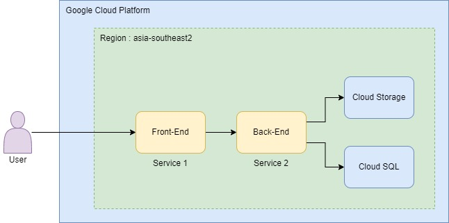  

Now, lets do it,

1. Go to compute engine option, enable and create a VM
  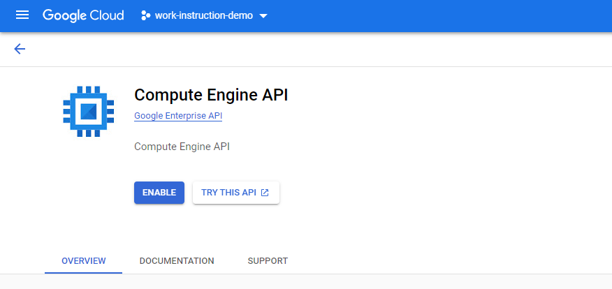  
  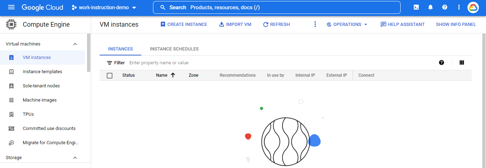  

2. Follow this option to create the vm one.
  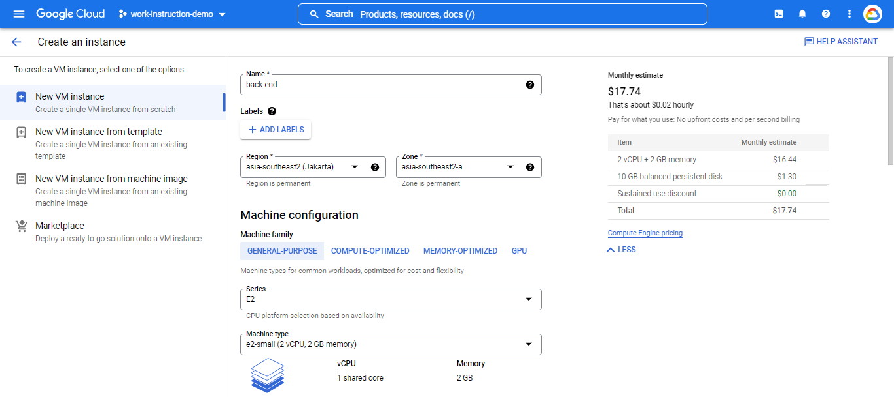  

3. And select what OS you want. In this project am using Ubuntu 20.04.
  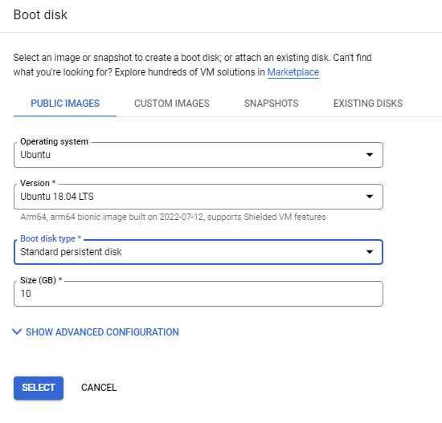  
  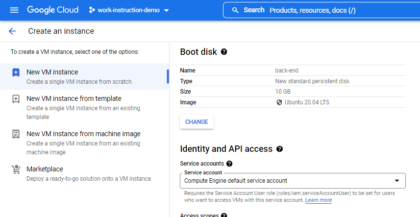  

4. In the firewall option, select “Allow HTTP traffic” and Allow HTTPS traffic”. Then click create.
    

5. Wait for a few second, and vm was run.
  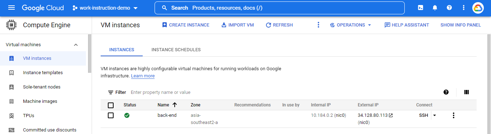  

6. Next we setup cloud sql as database for this back-end service. Create a instance.
  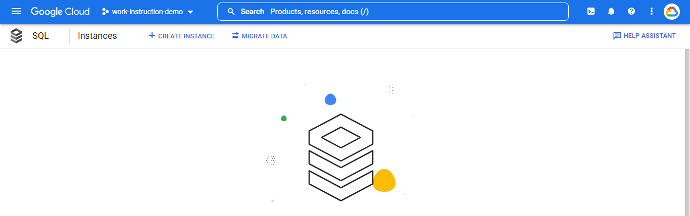  

7. Choose mysql for databases.
  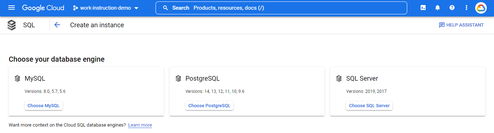  

8. Fill some info about the instance.
  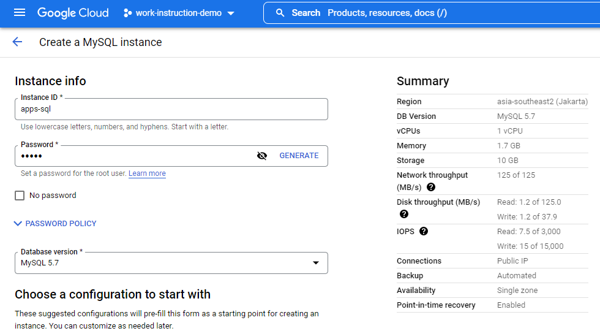  

9. Choose region just single zone.
  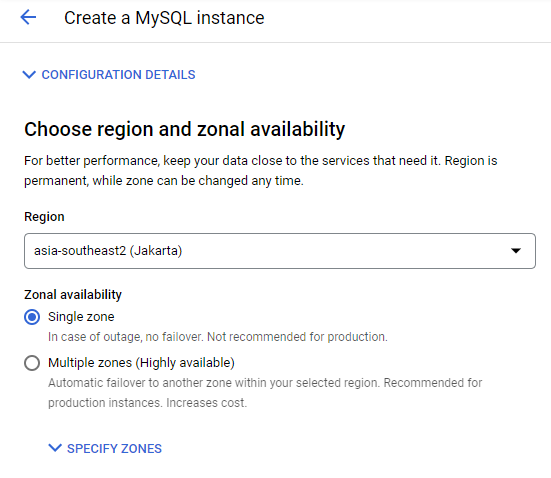  

10. In customize instance, choose machine type like this.
  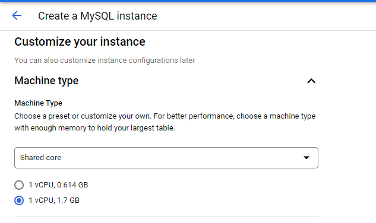  

11. And for storage, choose HDD.
  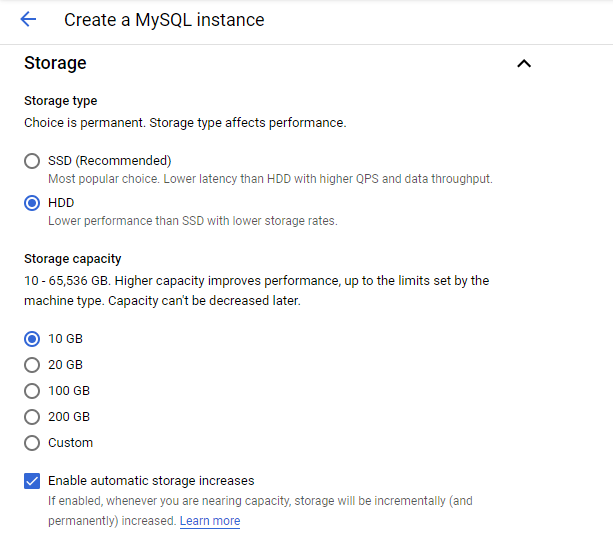  

12. And then, click create instance.
  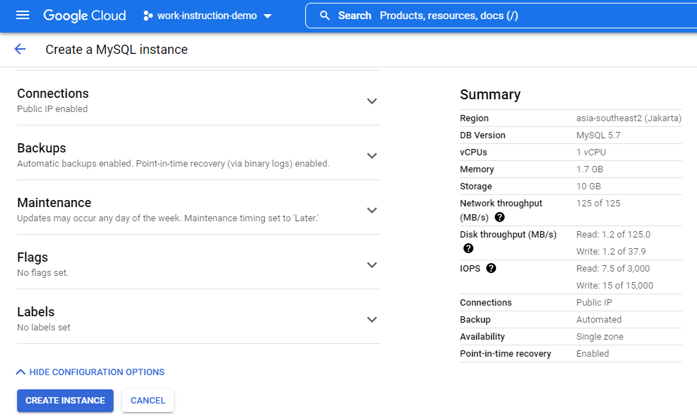  

13. The sql instance was created. Then go to connection option.
  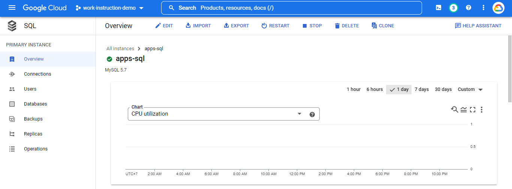  

14. Click “Add Network”.
  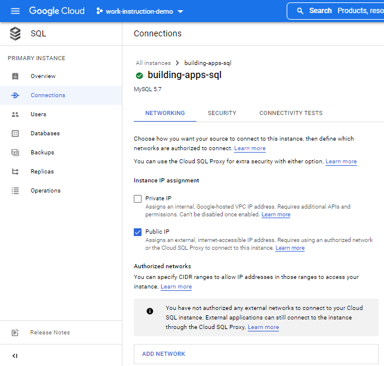  

15. Fill the name and CIDR like this and click done.
  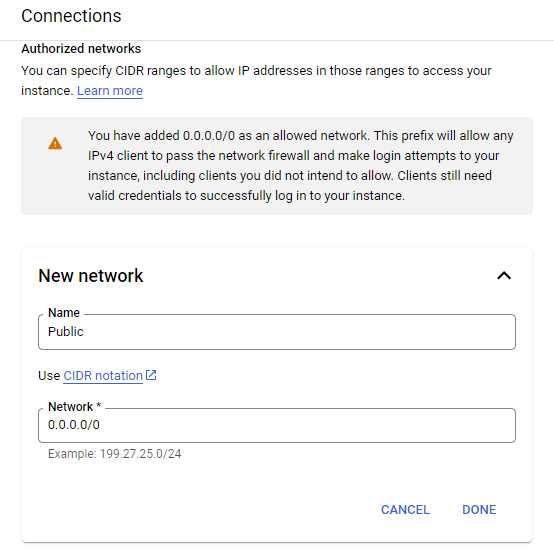  

16. And save the network.
  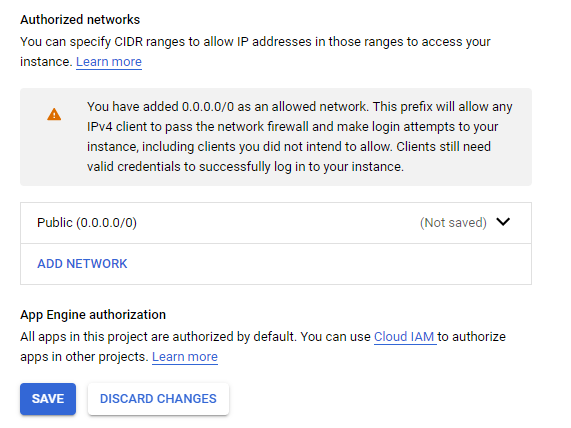  

17. Now we will connect the sql instance to vm instance was we created before. Save the ip address from sql instance.
  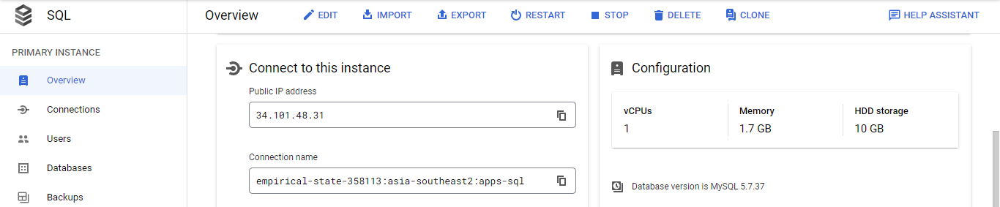  

18. Then go to the vm instance. And open ssh cloud shell. Run “sudo apt-get update”
    

19. And then run “sudo apt-get install mysql-client”
  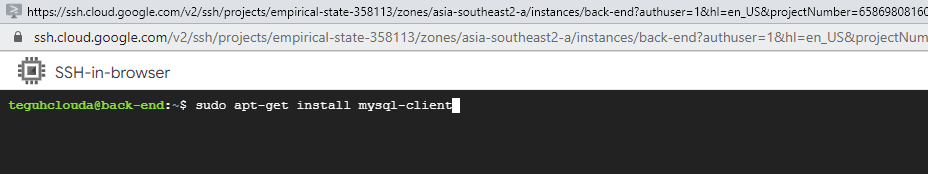  

20. If the mysql-client done to install, then we connect the sql one to vm. Run command like this (input the sql instance ip address).
  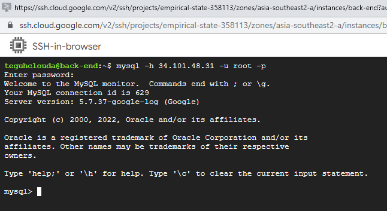  

21. Now we create new database.
  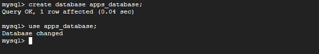  

22. And create table from the database. Use this command to create.
  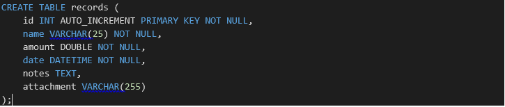  

