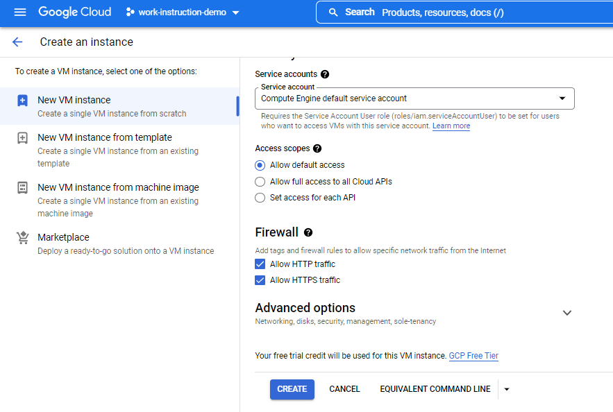

# Google Cloud Platform

## Work Instruction Building Apps on GCP

We will use several step for configuration this project and provision :
1.	Compute Engine as a back-end
2.	Cloud SQL
3.	Cloud Storage
4.	App Engine as a Front-end

And in this project, we using lifecycle management for cloud storage.

This is the architecture what we want to build on GCP.
    

Now, lets do it,

1. Go to compute engine option, enable and create a VM
    
    

2. Follow this option to create the vm one.
    

3. And select what OS you want. In this project am using Ubuntu 20.04.
    
    

4. In the firewall option, select “Allow HTTP traffic” and Allow HTTPS traffic”. Then click create.
    

5. Wait for a few second, and vm was run.
    

6. Next we setup cloud sql as database for this back-end service. Create a instance.
    

7. Choose mysql for databases.
    

8. Fill some info about the instance.
    

9. Choose region just single zone.
    

10. 

