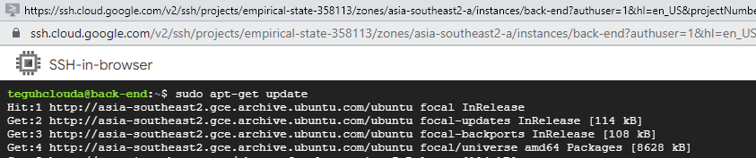

# Google Cloud Platform

## Work Instruction Building Apps on GCP

We will use several step for configuration this project and provision :
1.	Compute Engine as a back-end
2.	Cloud SQL
3.	Cloud Storage
4.	App Engine as a Front-end

And in this project, we using lifecycle management for cloud storage.

This is the architecture what we want to build on GCP.
    

Now, lets do it,

1. Go to compute engine option, enable and create a VM
    
    

2. Follow this option to create the vm one.
    

3. And select what OS you want. In this project am using Ubuntu 20.04.
    
    

4. In the firewall option, select “Allow HTTP traffic” and Allow HTTPS traffic”. Then click create.
    

5. Wait for a few second, and vm was run.
    

6. Next we setup cloud sql as database for this back-end service. Create a instance.
    

7. Choose mysql for databases.
    

8. Fill some info about the instance.
    

9. Choose region just single zone.
    

10. In customize instance, choose machine type like this.
    

11. And for storage, choose HDD.
    

12. And then, click create instance.
    

13. The sql instance was created. Then go to connection option.
    

14. Click “Add Network”.
    

15. Fill the name and CIDR like this and click done.
    

16. And save the network.
    

17. Now we will connect the sql instance to vm instance was we created before. Save the ip address from sql instance.
    

18. Then go to the vm instance. And open ssh cloud shell. Run “sudo apt-get update”
    

19. And then run “sudo apt-get install mysql-client”
    

20. If the mysql-client done to install, then we connect the sql one to vm. Run command like this (input the sql instance ip address).
    

21. Now we create new database.
    

22. And create table from the database. Use this command to create.
    
    

23. Run “show tables” to see the table of database.
    

24. Now the cloud sql instance and vm was connected. Next we configure cloud storage to save any media file from web input. Go to cloud storage and create a bucket.
    

25. Set the name of bucket.
    

26. And set the region.
    

27. Choose standar storage.
    

28. Set the default one.
    

29. And then create.
    

30. Now we was created the bucket of storage.
    

31. Now we config the back-end code before deploy to vm. I already have source code for back-end (disclaimer : this source code from dicoding), and then config. Config for TODO code imgUpload.js.
    

32. Config for TODO code record.js.
    

33. And then we create key for serviceaccountkey.json from google cloud platform. This key we use for acces gcs to create any object to there. Go to service account menu. And then click create service account.
    

34. Fill any requirement to the field.
    

35. Select role for this service. You can follow the below this capture. Then continue.
    

36. Just field Service account users role. Field your google cloud account who develop back-end program in compute engine (exp, user@gmail.com). Then click done.
    

37. You can see, the service account was created. Then we will create the key. Click the service account.
    

38. Go to the key, and click add key, then create new key.
    

39. Choose JSON and then click create.
    

40. You will noticed that the key was download to your local pc. Then use the key for your serviceaccountkey.json. just replace it.
    

