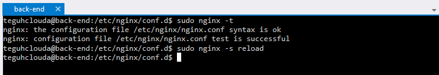
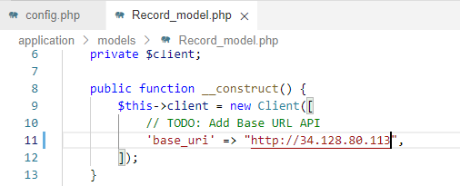

# Google Cloud Platform

## Work Instruction Building Apps on GCP

We will use several step for configuration this project and provision :
1.	Compute Engine as a back-end
2.	Cloud SQL
3.	Cloud Storage
4.	App Engine as a Front-end

And in this project, we using lifecycle management for cloud storage.

This is the architecture what we want to build on GCP.
    

Now, lets do it,

1. Go to compute engine option, enable and create a VM
    
    

2. Follow this option to create the vm one.
    

3. And select what OS you want. In this project am using Ubuntu 20.04.
    
    

4. In the firewall option, select “Allow HTTP traffic” and Allow HTTPS traffic”. Then click create.
    

5. Wait for a few second, and vm was run.
    

6. Next we setup cloud sql as database for this back-end service. Create a instance.
    

7. Choose mysql for databases.
    

8. Fill some info about the instance.
    

9. Choose region just single zone.
    

10. In customize instance, choose machine type like this.
    

11. And for storage, choose HDD.
    

12. And then, click create instance.
    

13. The sql instance was created. Then go to connection option.
    

14. Click “Add Network”.
    

15. Fill the name and CIDR like this and click done.
    

16. And save the network.
    

17. Now we will connect the sql instance to vm instance was we created before. Save the ip address from sql instance.
    

18. Then go to the vm instance. And open ssh cloud shell. Run “sudo apt-get update”
    

19. And then run “sudo apt-get install mysql-client”
    

20. If the mysql-client done to install, then we connect the sql one to vm. Run command like this (input the sql instance ip address).
    

21. Now we create new database.
    

22. And create table from the database. Use this command to create.
    
    

23. Run “show tables” to see the table of database.
    

24. Now the cloud sql instance and vm was connected. Next we configure cloud storage to save any media file from web input. Go to cloud storage and create a bucket.
    

25. Set the name of bucket.
    

26. And set the region.
    

27. Choose standar storage.
    

28. Set the default one.
    

29. And then create.
    

30. Now we was created the bucket of storage.
    

31. Now we config the back-end code before deploy to vm. I already have source code for back-end (disclaimer : this source code from dicoding), and then config. Config for TODO code imgUpload.js.
    

32. Config for TODO code record.js.
    

33. And then we create key for serviceaccountkey.json from google cloud platform. This key we use for acces gcs to create any object to there. Go to service account menu. And then click create service account.
    

34. Fill any requirement to the field.
    

35. Select role for this service. You can follow the below this capture. Then continue.
    

36. Just field Service account users role. Field your google cloud account who develop back-end program in compute engine (exp, user@gmail.com). Then click done.
    

37. You can see, the service account was created. Then we will create the key. Click the service account.
    

38. Go to the key, and click add key, then create new key.
    

40. Choose JSON and then click create.
    

41. You will noticed that the key was download to your local pc. Then use the key for your serviceaccountkey.json. just replace it.
    

42. Now go to compute engine. We will deploy back-end apps using node js. But before deployed, we must set this service account to the compute engine. So we must stop the vm then re-setting the service account.
    
    

43. Vm was stop. Now we re-setting the service account for this vm. Click the vm. Then click edit.
    

44. Scroll down until service account menu. And then choose service account was we created before. Then click save.
    

45. After we set it, then start the vm again. You can see vm was running.
    

46. Go to the vm, then following this command : 
    - sudo apt-get update
    - sudo apt-get install nodejs npm
    - sudo apt install git
    

47. Now we check npm dan node version was installed.
    

48. Now we deploy the back-end code in vm. I already have the code in this vm. You can download all the code from “https://github.com/teguhraisrahmadi/building-apps.git”. 
- Run this command to clone source code from github “git clone https://github.com/teguhraisrahmadi/building-apps.git --branch=back-end --single-branch”.
    

49. Go to the file.
    

50. Before we deploy the back-end program, we will set the firewall to allow acces from outside world to this vm. Right, go to vpc network firewall setting. Then click create firewall rule.
    

51. Fill the name and description.
    

52. Scroll down, then choose targets to Specified service account. Then choose Target service account to service account was we created. 
    

53. Fill source IPv4 ranges to 0.0.0.0/0. For protocol choose TCP and fill port 8000,8080,80.
    

54. Scroll down, then click create.
    

55. You can see, the firewall was created.
    

56. Now we back to compute engine, and deploy the back-end apps. Note, before we deployed the code, make sure you was replaced serviceaccountkey.json with new service account was we download before. If was, just following this command to deploy the back-end apps : 
    - npm install
    - npm run start
    

57. You can see the respone from “http://ip_public:8000”
    

58. The response was success that’s mean back-end program was success deployed. So, for the best experience tools, we use nginx for reverse proxy this server. Install the nginx,
    - “sudo apt-get install nginx”
    

59. Go to /etc/nginx/conf.d directory. Then create file backend.conf.
    

60. Then write this configuration.
    

61. Now we test the nginx configuration file. If success, then reload the nginx service.
    

62. You can see, it was success acces the back-end program without write the 8000 port.
    

63. For the best experience running back-end, we use pm2 for process manager. Now we install the pm2 in the back-end directory.
    - sudo npm install –g pm2
    

64. You can start your program just run this command :
    - pm2 start app.js
    

65. And you can stop the program just run this command : 
    - Pm2 stop app.js
    

66. You can see, when we run “pm2 start app.js”, back-end apps was success running on the vm.
    

67. Next step we will deploy the front-end apps to app engine. Go to app engine and click open In new window.
    

68. Open editor.
    

69. You can see the editor from cloud shell here. Then open new terminal.
    
    

70. Open the project :
    - “gcloud config set project [PROJECT_ID]”
    

71. I already have the front–end code. You can download all the code from “https://github.com/teguhraisrahmadi/building-apps.git”. Run this command to clone source code from github, 
    - “git clone https://github.com/teguhraisrahmadi/building-apps.git --branch=front-end --single-branch”.
    

72. Now, open the folder, and choose directory was we clone before.
    

73. Now we entered to the directory.
    

74. Got to : application -> config -> config.php. fill base url in todo code
    

75. application -> models -> Record_model.php. then fill the API url was we created on compute engine.
    

76. Save and deployed the front-end in app engine.
    

77. Now you can open the application from http://building-apps-dot-empirical-state-358113.et.r.appspot.com
    
    

78. You can add records for new insert data to the application. And you can choose file upload to gcs storage. Then click submit.
    

79. In records menu, you have new data was created.
    

80. You can click attachment to see the file.
    

Done, Thanks.
